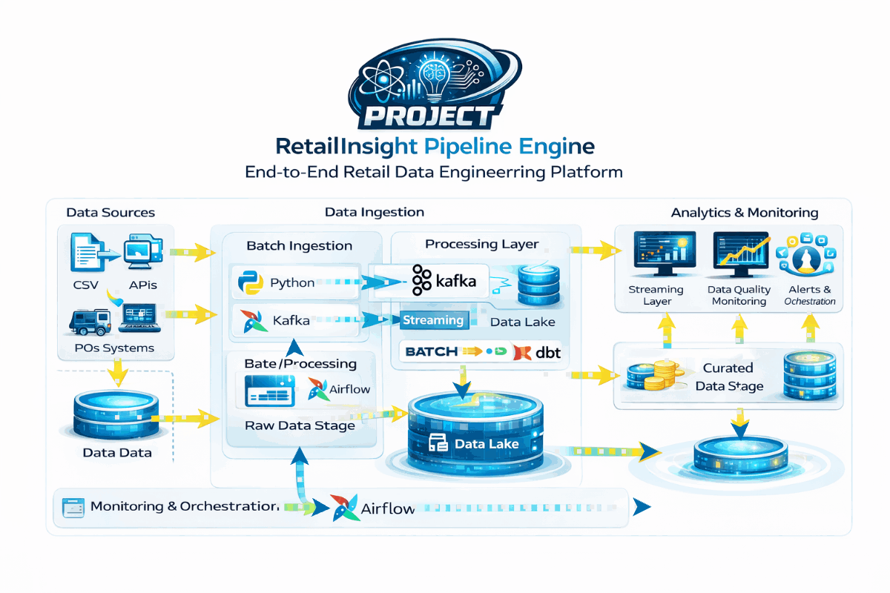

# 🚀 RetailInsight Pipeline Engine

### An End-to-End Retail Data Engineering & Analytics Platform

<p align="center">
  
  
  
  
  
</p>

---
<div>RetailInsight Pipeline Engine is a scalable, enterprise-style data platform designed to handle end-to-end retail analytics workflows. The system ingests data from multiple sources, processes it through streaming and batch pipelines, and transforms it into structured datasets for analytics and business intelligence. By combining tools like Kafka, Spark, Airflow, and data warehouse layers, the platform enables real-time insights, efficient data orchestration, and data-driven decision-making, simulating real-world retail data engineering systems.
</div>

## ✨ Key Features

- 📥 Multi-source data ingestion  
- ⚡ Real-time streaming using Kafka  
- 🔄 Batch & streaming data processing  
- 🧠 Data transformation using Spark / dbt  
- 🏗️ Data lake and warehouse architecture  
- 📊 Analytics-ready curated datasets  
- 🔁 Workflow orchestration with Airflow  
- 📈 Business intelligence & reporting layer  

---

## 🧭 Why Choose

- Simulates real-world enterprise data platform  
- Combines streaming + batch processing  
- Demonstrates end-to-end data lifecycle  
- Production-style modular architecture  
- Strong showcase of Data Engineering skills  

---

## 🏗️ System Architecture

<p align="center">
  
</p>

---

<!-- ## 🎬 Demo

<p align="center">
  
</p> -->

---

## ⚡ Quick Start

```bash
pip install -r requirements.txt
python main.py
```

---

## 🧩 Simple Example

Data Sources → Ingestion → Streaming (Kafka) → Processing (Spark/dbt) → Data Lake → Warehouse → Analytics

---

## 🗂️ Project Structure

```text

RetailInsight-Pipeline-Engine/
├── dags/
├── data/
│   └── raw/
├── spark_jobs/
├── scripts/
├── utils/
├── readme_docs/
├── Dockerfile
├── docker-compose.yaml
├── requirements.txt
└── README.md
```

---

## 📬 Contact

Chandrayee Kumar  
Python Developer | AI/ML Engineer  

---

## 🚀 Future Improvements

- 📊 Real-time dashboards  
- ☁️ Cloud deployment  
- 🔍 Data quality monitoring  
- 🤖 AI anomaly detection  
- 🔗 API integrations  
